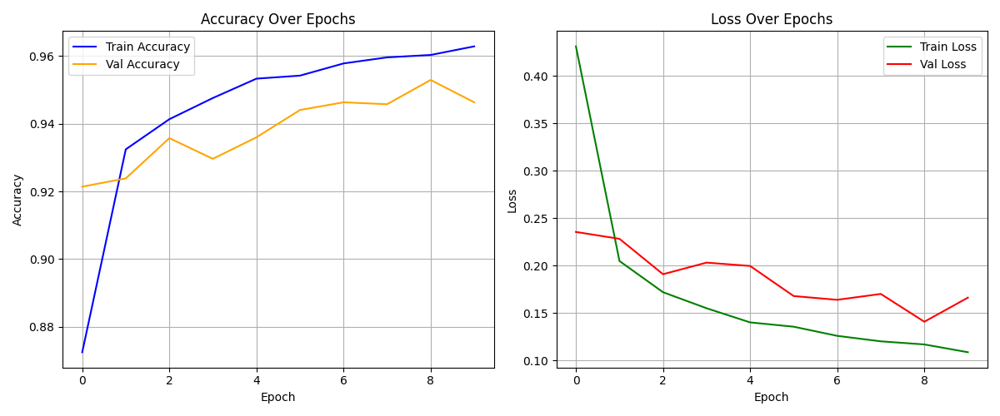

# 🌿 Plant Disease Detection using CNN

This project uses a **Convolutional Neural Network (CNN)** to detect plant diseases from leaf images. It helps identify whether a leaf is healthy or affected by a specific disease based on visual patterns.

---

## 📦 Dataset

We used a dataset from **Mendeley Data**:

🔗 [Plant Leaf Disease Dataset](https://data.mendeley.com/datasets/tywbtsjrjv/1)

This dataset contains **61,486 images** across **39 different classes**, including both healthy and diseased leaves. It includes various plants such as tomato, apple, corn, grape, strawberry, and more.

> Images were augmented using techniques like flipping, gamma correction, noise injection, PCA color augmentation, rotation, and scaling.

### 📁 How the Dataset is Used

The dataset is already available in the `dataset/` directory and ready for use. The training script automatically detects and uses the image categories inside this folder.

---

## 🏗️ Training the Model

The training script is located in the `scripts/` directory.

### 📌 Steps to Train

From your terminal, run the following command from the project root:

```bash
python scripts/train_model.py
```

> ⚠️ **Note:** Training can take several minutes or hours depending on your system.

### 🎯 Output Files

After training, the following files will be created in the `models/` directory:

- **`model.h5`** – The trained CNN model used for predictions.
- **`class_indices.pkl`** – A dictionary mapping class indices to class names. This is used during prediction to display readable class labels.
- **`history.pkl`** – Contains training history (accuracy and loss per epoch) and is used to plot performance graphs.

---

## 📈 Visualizing Training Metrics

You can visualize the training and validation accuracy/loss using the `print_chart.py` script.

### ▶️ Run the Chart Script

```bash
python scripts/print_chart.py
```

This script reads the `history.pkl` file and generates performance plots like the one below:



- **Left Chart**: Accuracy over epochs (Train vs Validation)
- **Right Chart**: Loss over epochs (Train vs Validation)

This visualization helps understand how well the model is learning and if it's overfitting.

---

## 🧪 Predicting Leaf Diseases

After training, you can test the model using `predict_test_images.py`.

### 📌 Steps to Predict

1. Place test images in the `testData/` directory.
   - You can use the sample images or add your own.
2. From the main directory, run:

```bash
python predict_test_images.py
```

The model will analyze each image and print the predicted class in the terminal.

### ✅ Example Output

```
testData/test_leaf2.jpg
1/1 ━━━━━━━━━━━━━━━━━━━━ 0s 66ms/step
Predicted class: Strawberry___Leaf_scorch
```

---

## 🗂️ Project Structure

```
plant-disease-detection/
├── dataset/                 # Leaf image categories (already available)
├── models/
│   └── model.h5             # Trained CNN model
│   └── class_indices.pkl    # Mapping of class indices to class names
│   └── history.pkl          # Training history for plotting
├── scripts/
│   └── train_model.py       # Model training script
│   └── print_chart.py       # Script to visualize training metrics
├── testData/                # Images for prediction
├── predict_test_images.py   # Script to predict diseases from test images
└── README.md                # This file
```

---

## 👥 Authors

- **Samuel Buendía** – [GitHub](https://github.com/samuelbuendia) · [LinkedIn](https://www.linkedin.com/in/samuelbuendia/) · [Portfolio](https://samuelbuendia.com)
- **Qasam Hussain** – [GitHub](https://github.com/Qasimhussain5753) · [LinkedIn](https://linkedin.com/in/qasam-hussain-53a54912b)

---

## 📃 License

This project is for **academic and educational use**. The dataset is publicly available via [Mendeley Data](https://data.mendeley.com/datasets/tywbtsjrjv/1).

---

Happy coding and good luck detecting plant diseases! 🌱🧠🖼️
